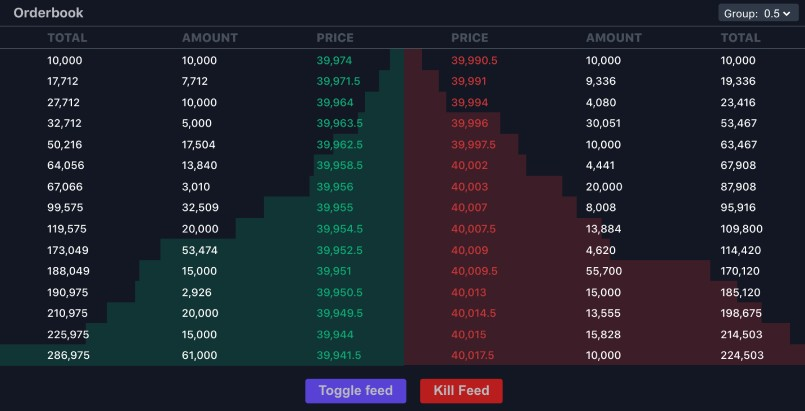

<p align="center">
  
</p>

# Crypto Orderbook Application

Crypto Orderbook is an open source scalable dynamic orderbook system for generating oderbooks that show the volume of buy and sell orders at different $ prices for pairs of currencies. Orderbooks are generated from live crypto stock exchange web socket data messages.

## What is an orderbook

An order book takes live buy and sell data and constructs a live repersentation of a currency on a spceicific market at a specific moment in time. The orderbook takes messages from a websocket at high speed and the application constructs a live list of ordered buys and sells, continously adding, removing, updating and grouping different values within each list.

The orderbook consists of 2 different tables:

### Buy table 

Displays the volume of buy orders at different prices. This list is ordered by price DESC.

### Sell table

Displays the volume of sell orders at different prices. This list is ordered by price ASC.

## Orderbook features

The orderbook has several features:

<p align="left">
  
</p>

### Group

Allows user to control the grouping of price bands within the orderbook. Each currrency pair (e.g. ETH/USD) has a different array of group values.

<p align="left">
  
</p>

### Toggle Currrrency

Allows user to toggle which currency is loaded into the orderbook.

<p align="left">
  
</p>

### Kill Feed

Closes the websocket connection and when clicked again will restart the websocket connnection with the currrent configuration. 

##  Getting started

Clone the application

```
git clone https://github.com/ryanmstokes/cypto-orderbook.git
```

Install the application and dependencies:

```
npm i
```

Start the application:

`````
npm start
`````

Runs the app in the development mode.

Open [http://localhost:3000](http://localhost:3000) to view it in the browser.

The page will reload if you make edits. You will also see any lint errors in the console.

## Configuring orderbooks

The application uses a novel configuration system and set of files (found in /config) to define currencies and generate currency pair configurations for orderbooks. The application takes the configuration files and loads them into the applications store (Redux), while a custom orderbook component, set of actions, websocket manager and set of atomically designed components is used to generate the orderbooks and its features.

## Defining currencies

To define currrencies in the appliction add a currency defintion to the lists property in the config/lists.json file:

```code
 /** /config/tables
 ...
 lists:{
   ETH: {

       title: "ETH",

       inc: [0.05, 0.1, 0.25],

       ticker: 0.05,

       product_ids: "PI_ETHUSD"
   },
   ...
 }
```

## Defining orderbook currency pairs

In order to generate an orderbook we must define an orderbook currency pair within the configuration. In order to do this add a orderbook pair definition in the config.json file:

```
/** /config
...
 orderbooks: {
    btc_eth: {
      title: 'Orderbook 1',
      products: ['XBTC', 'ETH'],
      current: 'XBTC'
    }, orderbooks: {
    btc_eth: {
      title: 'Orderbook 1',
      products: ['XBTC', 'ETH'],
      current: 'XBTC'
    },
    ...
 }
```

## Generating Orderbooks within the application

Create the orderbook by importing the orderbook component and passing it the name of the currency pair you wish to load:

```
<OrderBook pair="btc_eth" />
```

## Technology

The application has been developed using a functional programminng style, utilising the latest SPA technologies.

### Typescript

Untyped 3rd party npm packages are declared in **src/modules.d.ts**

The application is fully typed. Global types and interfaces can be found in **/types.ts.**

### React

Latest version of React using React hooks and a purely functional approach.

### Redux

Latest version of Redux using Redux toolki and Redux Saga in tandem with react hooks.

### React Testing Library

70% unit test coverage using React testing library, Jest, and mock-store library.

### Web Sockets

Live market data is taken from a websocket connection from a major crypto exchange and data is saved to the Redux store and sorted for display.

### Styled Components and Theme

Styled componts library is used to style all components and all elements of orrdeerbook are configurable via a global theme file found in **/theme**.

## Testing

Unit tests are written with React Testing Library for key components and funtions within the application. Test files are located in directories alongside their corresponding units.

To run tests:

```
npm test
```

Launches the test runner in the interactive watch mode.

Redux is mocked within unit tests using redux-mock-store package and Jest.

## Production

To build the application for production:

```
npm run build
```

Builds the app for production to the /build` folder.

It correctly bundles React in production mode and optimizes the build for the best performance.